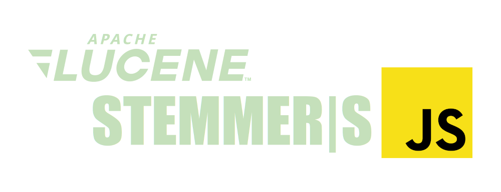

# Lucene Stemmers in JavaScript

<div align="center">



</div>

<div align="left">

[](https://www.npmjs.com/package/lucene-stemmers)
[](https://github.com/tomsquest/lucene-stemmers/actions/workflows/check.yml)

</div>

> **`Lucene Stemmers`** is a port of Lucene's stemmers in JavaScript.

<!-- START doctoc generated TOC please keep comment here to allow auto update -->
<!-- DON'T EDIT THIS SECTION, INSTEAD RE-RUN doctoc TO UPDATE -->
## Table of contents

- [Changelog](#changelog)
- [Install](#install)
- [Usage](#usage)
- [Stemmers implemented](#stemmers-implemented)
- [TODO](#todo)

<!-- END doctoc generated TOC please keep comment here to allow auto update -->

## Changelog

> See [CHANGELOG.md](CHANGELOG.md)

## Install

```sh
npm install lucene-stemmers
```

## Usage

In plain **JavaScript**:

```js
const { stemFrenchMinimal } = require("lucene-stemmers");

const stemmed = stemFrenchMinimal("chevaux");
// stemmed === "cheval"
```

In **Typescript**:

```ts
import { stemFrenchMinimal } from "lucene-stemmers";

const stemmed = stemFrenchMinimal("chevaux");
// stemmed === "cheval"
```

## Stemmers implemented

These stemmers are available:

- [x] French
  - [x] Minimal
    - Function: `stemFrenchMinimal`
    - [Lucene source code](https://gitbox.apache.org/repos/asf?p=lucene.git;a=blob;f=lucene/analysis/common/src/java/org/apache/lucene/analysis/fr/FrenchMinimalStemmer.java)
  - [x] Light
    - Function: `stemFrenchLight`
    - [Lucene source code](https://gitbox.apache.org/repos/asf?p=lucene.git;a=blob;f=lucene/analysis/common/src/java/org/apache/lucene/analysis/fr/FrenchLightStemmer.java)
- [x] Italian
  - [x] Light
    - Function: `stemItalianLight`
    - [Lucene source code](https://gitbox.apache.org/repos/asf?p=lucene.git;a=blob;f=lucene/analysis/common/src/java/org/apache/lucene/analysis/it/ItalianLightStemFilter.java)

## TODO

- [ ] Add why
- [ ] Add more stemmers
- [ ] Publish browser version
- [ ] CI
